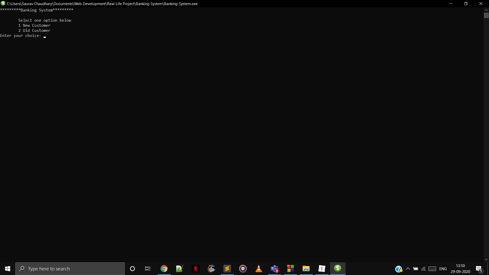
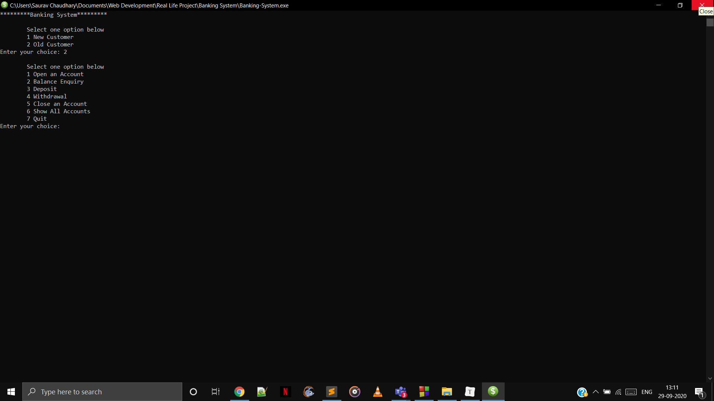

# Bank Management System-The Virtual Bank

Bank Management System Project is developed in C++.Its an application of Banking providing minimal features of a banking system.

It has got features like:-

- Open an Account

- Balance Enquiry

- Deposit

- Withdrawal

- Close an Account

- Show All Accounts

  

